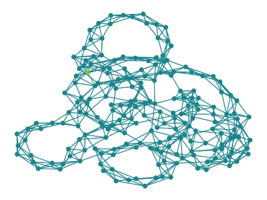

# DBGNN_paper-companion

This repository contains the code to reproduce the results of the paper: "Dirac-Bianconi Graph Neural Networks -- Enabling Non-Diffusive Long-Range Graph Predictions". The repository contains code to train ML models and to make the trajectory plots. The full code for generating the figures and the trained models can be found on Zenodo: [https://doi.org/10.5281/zenodo.12687981](https://doi.org/10.5281/zenodo.12687981).

## Paper Abstract

The geometry of a graph is encoded in dynamical processes on the graph. Many graph neural network (GNN) architectures are inspired by such dynamical systems, typically based on the graph Laplacian. Here, we introduce Dirac--Bianconi GNNs (DBGNNs), which are based on the topological Dirac equation recently proposed by Bianconi. Based on the graph Laplacian, we demonstrate that DBGNNs explore the geometry of the graph in a fundamentally different way than conventional message passing neural networks (MPNNs). While regular MPNNs propagate features diffusively, analogous to the heat equation, DBGNNs allow for coherent long-range propagation. Experimental results showcase the superior performance of DBGNNs over existing conventional MPNNs for long-range predictions of power grid stability and peptide properties. This study highlights the effectiveness of DBGNNs in capturing intricate graph dynamics, providing notable advancements in GNN architectures.

## Feature Propagation Comparison

The following GIFs illustrate the differences in feature propagation between Dirac-Bianconi Graph Neural Networks (DBGNN) and traditional Message Passing Neural Networks (MPNN). These visualizations highlight how DBGNN maintains the coherence of features over long distances, compared to the more diffusive propagation in MPNNs.

| DBGNN Feature Propagation | MPNN Feature Propagation |
|:-------------------------:|:-----------------------:|
|  |  |


## Training of the ML models
```
conda env create -n py310ptg --file py310ptg.yml
```
The file conda_environment.yml is stored in training_model.

The following parameters need to be set in ```start_ray.py```:
```
dataset_path = Path(PATHMISSING)
dataset_path = Path(PATHMISSING)
tmp_dir = "TMP_PATH"
```

Afterward, the script ```start_ray.py``` can be executed.


## Trajectories
The language Julia needs to be installed to generate the plots. First, the package needs to be activated and instantiated. Afterward, the plots can be generated by executing ```julia generate_publication_figures.jl```.  

**Reference**:
If you find this work useful, please cite the paper:

```bibtex
@article{nauck2024dirac,
  title={Dirac--Bianconi Graph Neural Networks -- Enabling Non-Diffusive Long-Range Graph Predictions},
  author={Christian Nauck, Rohan Gorantla, Michael Lindner, Antonia S. J. S. Mey, Frank Hellmann},
  journal={arXiv preprint arXiv:2407.12419},
  year={2024}
}
```

In case of any problems or questions, do not hesitate to contact us.

